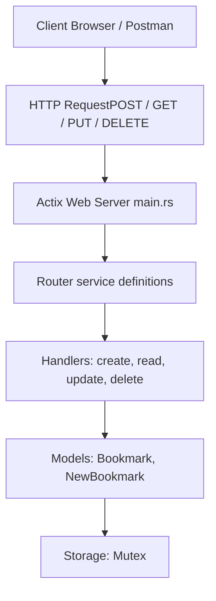

## Bookmark API (Rust / Actix‑Web)

A simple, in‑memory CRUD backend for managing bookmarks, built in Rust with Actix‑Web.

###  Current Features

* **POST /bookmarks** – Create a new bookmark (URL, title, description), generates UUID + timestamp
* **GET /bookmarks** – List all bookmarks
* **GET /bookmarks/{id}** – Fetch a single bookmark by its UUID
* **PUT /bookmarks/{id}** – Update an existing bookmark’s data & timestamp
* **DELETE /bookmarks/{id}** – Remove a bookmark by UUID
* **Thread‑safe in‑memory store** via `web::Data<Mutex<HashMap<Uuid,Bookmark>>>`

---

##  Architecture

<details>
<summary>Textual overview</summary>

```
Frontend (or Postman)
        │
        ▼
  HTTP Request (POST / GET / PUT / DELETE)
        │
        ▼
  Actix Web Server (main.rs)
        │
        ▼
     Router (Acts on path + method)
        │
        ▼
     Handlers (create, read, update, delete logic)
        │
        ▼
     Models (Bookmark, NewBookmark structs)
        │
        ▼
     Storage (in‑memory HashMap for now)
```

</details>



---

##  Future Prospects & Roadmap

1. **Durable Storage**

   * Swap in SQLite or Postgres (via [SQLx](https://docs.rs/sqlx) or Diesel)
   * Migrate existing in‑memory store to a real DB

2. **Multi‑User & Authentication**

   * Add JWT sign‑up / login
   * Scope each user’s bookmarks to their own account

3. **Search & Tagging**

   * Integrate full‑text search (e.g. Tantivy)
   * Auto‑suggest tags via embeddings

4. **Real‑Time Notifications**

   * WebSocket broadcasts on create / delete
   * GraphQL subscriptions (async‑graphql)

5. **OpenAPI & Generated Clients**

   * Auto‑generate Swagger/OpenAPI docs (e.g. via Paperclip)
   * Provide a TypeScript client SDK

6. **Deployment & CI/CD**

   * Dockerize & deploy on Fly.io / Render / AWS
   * GitHub Actions for build, test, and push

7. **Decentralization & Web3 (stretch)**

   * Pin snapshots of each bookmark to IPFS
   * Optional NFT‑minting of bookmarks metadata

8. **AI‑Powered Enhancements**

   * Page summarization with OpenAI or local LLM
   * Automatic categorization / tagging

---

##  How to Run

```bash
git clone <repo>
cd bookmark_rust
cargo run
```

* Server will listen on `http://127.0.0.1:8080`
* Use Postman or `curl` to interact with your CRUD endpoints

---
